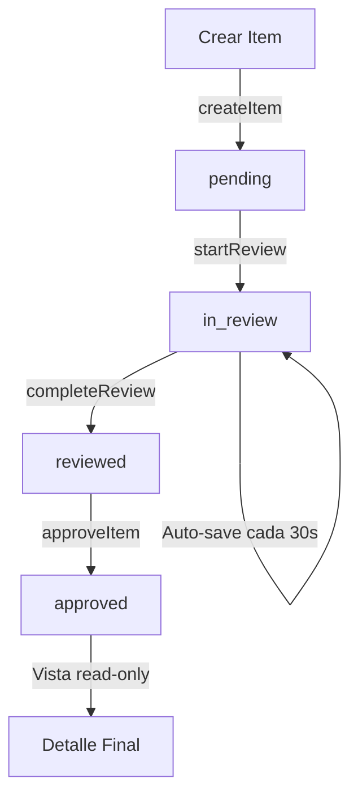

# 📝 Flujo de Auto-Guardado - Revisiones Técnicas

## 🎯 Objetivo

Implementar un sistema de auto-guardado inteligente que persiste el progreso del usuario en cada estado de la revisión técnica, permitiendo que el técnico pueda abandonar y retomar su trabajo sin pérdida de datos.

---

## 📊 Estados de Revisión (`ReviewStatus`)

```typescript
export type ReviewStatus = 'pending' | 'in_review' | 'reviewed' | 'approved';
```

### **1. `pending`**

- **Cuándo**: Justo después de crear el item con información básica (Step 1)
- **Qué se guarda**:
    - `serial_number` ✅
    - `product_id` ✅
    - `equipment_type` ✅
    - `batch_id` ✅
- **Acción**: `createItem()` → guarda y queda en estado `pending`
- **UI**: Usuario completa Step 1 y hace clic en "Continuar"

### **2. `in_review`**

- **Cuándo**: Después de llamar `startReview()` → técnico entra al formulario de revisión (Step 2)
- **Qué se guarda**:
    - Todos los campos de `attributes_json` (detalles técnicos específicos del tipo de equipo)
    - **Auto-guardado**: Después de **30 segundos** sin interacción del usuario
- **Acción**: `updateItemDetails()` → actualiza `attributes_json` sin cambiar el estado
- **UI**: Usuario llena formulario de Step 2, los cambios se guardan automáticamente cada 30s

### **3. `reviewed`**

- **Cuándo**: Técnico completa el formulario y hace clic en "Finalizar Revisión"
- **Qué se guarda**:
    - `suggested_grade` (calculado por backend) ✅
    - `confidence` (nivel de confianza del algoritmo) ✅
    - `breakdown` (desglose del cálculo) ✅
- **Acción**: `completeReview()` → cambia estado a `reviewed`
- **UI**: Usuario ve Step 3 con el grado sugerido

### **4. `approved`**

- **Cuándo**: Técnico aprueba el item con el grado final
- **Qué se guarda**:
    - `grade` (grado final aprobado) ✅
    - `review_status = 'approved'` ✅
- **Acción**: `approveItem()` → finaliza el flujo
- **UI**: Item bloqueado, se muestra vista de detalle read-only

---

## 🔄 Flujo Completo



---

## 🛠️ Implementación Técnica

### **Hook: `useAutoSaveReview`**

```typescript
const {
	isDirty, // Hay cambios sin guardar
	isSaving, // Guardando actualmente
	lastSaved, // Última fecha de guardado
	saveBasicInfo, // Guardar paso 1 (pending)
	markDetailsChanged, // Marcar cambios en detalles (inicia auto-save)
	saveDetailsNow, // Forzar guardado inmediato
	resetDirty, // Resetear estado dirty
} = useAutoSaveReview({
	branchId,
	itemId,
	reviewStatus,
	equipmentType,
	onSaveSuccess: (itemId) => {
		/* ... */
	},
	onSaveError: (error) => {
		/* ... */
	},
});
```

### **Componentes Actualizados**

1. **`batches/[batchId]/[itemId].tsx`** (Modo A - Items de Lote)
    - ✅ Integrado hook de auto-save
    - ✅ Step 1 solo visible en creación
    - ✅ Auto-start review para items `pending`
    - ✅ Vista read-only para items `approved`

2. **`items/[itemId].tsx`** (Modo B - Items Globales)
    - ✅ Integrado hook de auto-save
    - ✅ Misma lógica que Modo A
    - ✅ Soporte para `batch_id` opcional

3. **`Step2FullReview.tsx`** (Formulario de Revisión)
    - ✅ Callback `onFieldChange` para notificar cambios
    - ✅ Indicador visual de auto-save:
        - 🔄 "Guardando..." (isSaving)
        - ⏰ "Cambios sin guardar" (isDirty)
        - ✅ "Guardado HH:MM:SS" (lastSaved)
    - ✅ Botón "Guardar" manual opcional

---

## 📋 Reglas de Negocio

### **Guardado Automático (Step 2)**

- ⏱️ **Timer**: 30 segundos de inactividad
- 🔄 **Reset del timer**: Cada vez que el usuario modifica un campo
- 💾 **Guardado**: Solo si hay cambios pendientes (`isDirty = true`)
- 🚫 **No guardar**: Si ya hay un guardado en progreso (`isSaving = true`)

### **Navegación Inteligente**

- **Item `pending`** → Auto-ejecuta `startReview()` → Salta a Step 2
- **Item `in_review`** → Carga Step 2 con datos existentes
- **Item `reviewed`** → Carga Step 3 (calificación)
- **Item `approved`** → Muestra vista read-only (sin steps)

### **Prevención de Pérdida de Datos**

- ✅ Auto-save en Step 2 antes de cambiar de paso
- ✅ Confirmación si hay cambios sin guardar al navegar atrás
- ✅ Recargar datos si el usuario vuelve después de abandonar

---

## 🎨 Indicadores Visuales

### **Header de Step 2**

```
┌─────────────────────────────────────────────────────────────┐
│ 📋 Revisión Técnica Completa                        [Estado] │
│ Los cambios se guardan automáticamente después de 30s...    │
└─────────────────────────────────────────────────────────────┘
```

**Estados posibles:**

- 🔄 **Guardando...** (spinner animado)
- ⏰ **Cambios sin guardar** (icono reloj amarillo)
- ✅ **Guardado 14:30:45** (check verde)

---

## 🧪 Casos de Prueba

### **Caso 1: Crear y Abandonar en Step 1**

1. Usuario crea item con serial "ABC123"
2. Usuario hace clic en "Continuar"
3. Item se guarda con `status = pending`
4. Usuario cierra pestaña ❌
5. **Resultado**: Al volver, item existe en DB con status `pending`

### **Caso 2: Crear y Abandonar en Step 2**

1. Usuario crea item y llega a Step 2
2. Usuario llena 5 campos del formulario
3. Usuario espera **30 segundos** sin tocar nada
4. Auto-save ejecuta `updateItemDetails()` ✅
5. Usuario cierra pestaña ❌
6. **Resultado**: Al volver, los 5 campos están guardados

### **Caso 3: Editar Item Existente con `pending`**

1. Usuario hace clic en item #10 desde el listado
2. Item tiene `review_status = 'pending'`
3. **Auto-ejecuta** `startReview()` → cambia a `in_review`
4. **Salta directo a Step 2** (no muestra Step 1)
5. Usuario continúa editando

### **Caso 4: Editar Item con `in_review`**

1. Usuario hace clic en item #11 con `status = in_review`
2. Carga Step 2 con datos de `attributes_json`
3. Usuario modifica campo "RAM"
4. Espera 30s → Auto-save ✅
5. Usuario cierra pestaña
6. **Resultado**: Al volver, campo "RAM" está actualizado

### **Caso 5: Ver Item Aprobado**

1. Usuario hace clic en item #12 con `status = approved`
2. **No muestra steps**, muestra vista read-only
3. Usuario ve todos los datos finales
4. Solo botón disponible: "Volver al Lote"

---

## 📦 Endpoints Utilizados

| Estado      | Acción             | Endpoint                     | Método |
| ----------- | ------------------ | ---------------------------- | ------ |
| `pending`   | Crear item         | `/items`                     | POST   |
| `in_review` | Iniciar revisión   | `/items/:id/start-review`    | POST   |
| `in_review` | Guardar detalles   | `/items/:id/details`         | PATCH  |
| `reviewed`  | Completar revisión | `/items/:id/complete-review` | POST   |
| `approved`  | Aprobar item       | `/items/:id/approve`         | POST   |

---

## 🚀 Próximas Mejoras

- [ ] Confirmación antes de navegar con cambios sin guardar
- [ ] Offline support (guardar localmente si no hay conexión)
- [ ] Historial de cambios (auditoría)
- [ ] Auto-save configurable (permitir ajustar el delay)
- [ ] Indicador de "guardando en background" más visible
