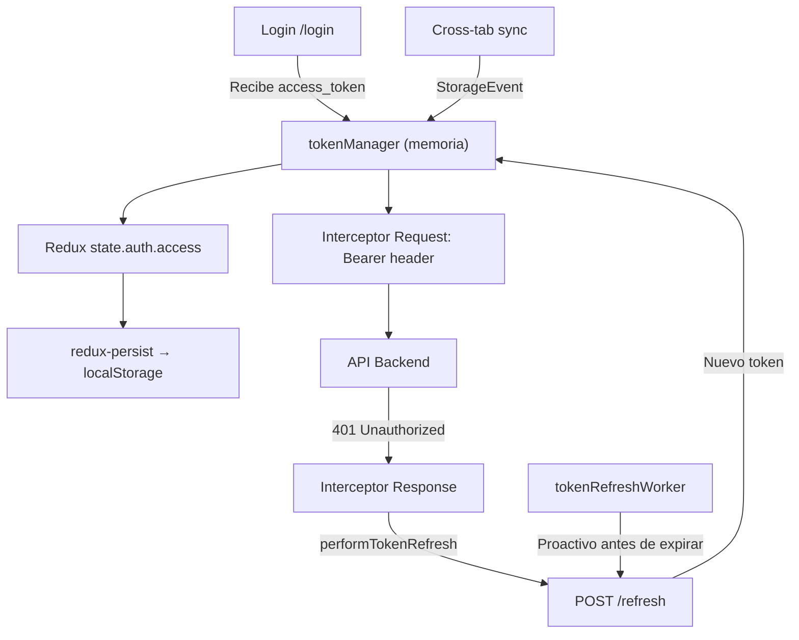
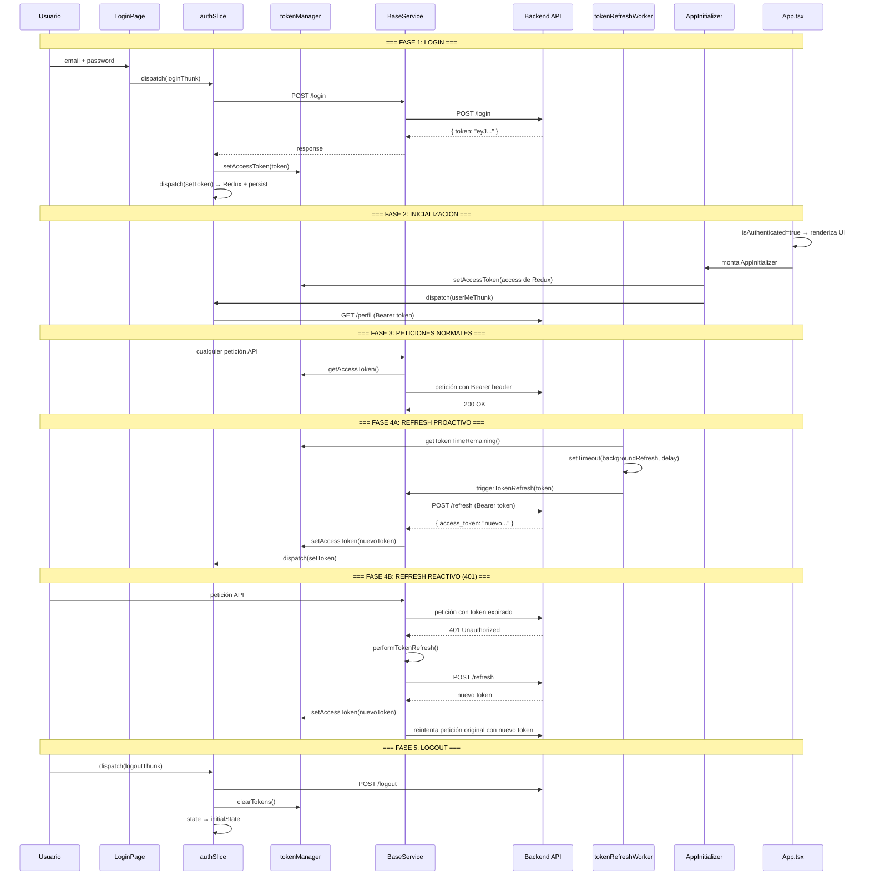

# Flujo Completo del Token y Refresh Token — ERP Front

> Documento generado el 2026-02-10. Describe **todo** el ciclo de vida del access token y el mecanismo de refresh en el frontend.

---

## Tabla de Contenidos

1. [Visión General de la Arquitectura](#1-visión-general-de-la-arquitectura)
2. [Almacenamiento del Token](#2-almacenamiento-del-token)
3. [Flujo de Login](#3-flujo-de-login)
4. [Inicialización de la App](#4-inicialización-de-la-app)
5. [Interceptor de Request (adjuntar token)](#5-interceptor-de-request-adjuntar-token)
6. [Interceptor de Response (manejo del 401)](#6-interceptor-de-response-manejo-del-401)
7. [Refresh Proactivo (Worker en Background)](#7-refresh-proactivo-worker-en-background)
8. [Función performTokenRefresh (núcleo del refresh)](#8-función-performtokenrefresh-núcleo-del-refresh)
9. [Validación de Sesión en App.tsx](#9-validación-de-sesión-en-apptsx)
10. [Sincronización entre Pestañas](#10-sincronización-entre-pestañas)
11. [Uso del Token en Notificaciones SSE](#11-uso-del-token-en-notificaciones-sse)
12. [Flujo de Logout](#12-flujo-de-logout)
13. [ForceLogout (utilidad de emergencia)](#13-forcelogout-utilidad-de-emergencia)
14. [Caso Especial: FalabellaApi.service.ts](#14-caso-especial-falabellaApiservicets)
15. [Diagrama de Flujo Completo](#15-diagrama-de-flujo-completo)
16. [Resumen de Archivos y Funciones](#16-resumen-de-archivos-y-funciones)

---

## 1. Visión General de la Arquitectura

El sistema utiliza **JWT (JSON Web Tokens)** con un esquema de **access token + refresh implícito** (no hay un refresh token separado; el propio access token se envía al endpoint `/refresh` para obtener uno nuevo dentro de una ventana de tiempo definida por `iat + REFRESH_TTL`).



---

## 2. Almacenamiento del Token

### Archivo: [`src/services/auth/tokenManager.ts`](file:///c:/Users/Usuario/Desktop/Zentria/erp-front/src/services/auth/tokenManager.ts)

El token se almacena **principalmente en memoria** (variable `memoryAccessToken`), NO en localStorage directamente. Redux-persist guarda `state.auth.access` en localStorage como respaldo para rehidratación entre recargas.

| Función                         | Descripción                                                                             |
| ------------------------------- | --------------------------------------------------------------------------------------- |
| `getAccessToken()`              | Retorna `memoryAccessToken` (el token en RAM)                                           |
| `setAccessToken(token)`         | Guarda el token en `memoryAccessToken` y llama a `markActivity()`                       |
| `clearTokens()`                 | Pone `memoryAccessToken = null` y `lastActivityAt = null`                               |
| `decodeJwtPayload(token)`       | Decodifica el payload Base64 del JWT sin librerías externas                             |
| `isTokenValid(token?)`          | Verifica que `exp * 1000 > Date.now()` (no expirado)                                    |
| `getTokenTimeRemaining(token?)` | Retorna milliseconds restantes antes de expiración (`exp`)                              |
| `getRefreshExpiresAt(token?)`   | Calcula `iat * 1000 + REFRESH_TTL_MINUTES * 60 * 1000` → deadline para poder refrescar  |
| `canRefresh(token?)`            | Retorna `true` si `Date.now() < refreshExpiresAt` (aún dentro de la ventana de refresh) |
| `markActivity(timestamp?)`      | Registra la última actividad del usuario (para inactividad)                             |
| `isInactive(timeoutMs)`         | Verifica si ha pasado `timeoutMs` desde la última actividad                             |

**Variable de entorno clave:** `VITE_JWT_REFRESH_TTL_MINUTES` (default: `1440` = 24h)

---

## 3. Flujo de Login

### Archivo: [`src/store/slices/auth/authSlice.ts`](file:///c:/Users/Usuario/Desktop/Zentria/erp-front/src/store/slices/auth/authSlice.ts)

### `loginThunk` (líneas 69–102)

```
Usuario envía email + password
        │
        ▼
ApiService.fetchData({ url: '/login', method: 'post', isLoginRequest: true })
        │
        ▼
extractAccessToken(resp.data)  ← busca en: payload.token, payload.access,
        │                         payload.access_token, payload.data.token,
        │                         payload.data.access, payload.data.access_token
        ▼
tokenManager.setAccessToken(token)   ← guarda en memoria
        │
        ▼
dispatch(setToken({ access: token, markActivity: true }))  ← guarda en Redux
        │
        ▼
return { access: token }  → loginThunk.fulfilled:
                             state.access = token
                             state.isAuthenticated = true
```

### Función auxiliar: `extractAccessToken` (líneas 15–30)

Busca el token en múltiples posibles ubicaciones del payload de respuesta:

- `payload.token`
- `payload.access`
- `payload.access_token`
- `payload.data.token`
- `payload.data.access`
- `payload.data.access_token`

Retorna el primer `string` no vacío encontrado.

### Reducer `setToken` (línea 200–204)

```typescript
setToken: (state, action: PayloadAction<{ access: string; markActivity?: boolean }>) => {
	state.access = access; // Guarda en Redux (y por persist → localStorage)
	if (markActivity) tokenManager.markActivity();
};
```

---

## 4. Inicialización de la App

### Archivo: [`src/components/AppInitializer.tsx`](file:///c:/Users/Usuario/Desktop/Zentria/erp-front/src/components/AppInitializer.tsx)

Se monta dentro de `<App>` cuando `isAuthenticated = true`. Ejecuta 3 efectos:

### Efecto 1 — Sincronización inicial (líneas 33–48)

```
Al montar (una sola vez):
  ├─ Si ruta pública → no hacer nada
  ├─ Si NO hay `access` en Redux → dispatch(logout()) + navigate('/login')
  └─ Si SÍ hay `access` → tokenManager.setAccessToken(access)
                            (sincroniza Redux → memoria)
```

### Efecto 2 — Cargar perfil del usuario (líneas 51–65)

```
Si isAuthenticated && access && no hay user cargado:
  └─ dispatch(userMeThunk())  ← usa tokenManager.getAccessToken()
                                  para GET /perfil con Bearer header
```

### Efecto 3 — Redirigir si no autenticado (líneas 68–75)

```
Si ruta privada && no hay access → navigate('/login')
```

### Archivo: [`src/store/storeSetup.ts`](file:///c:/Users/Usuario/Desktop/Zentria/erp-front/src/store/storeSetup.ts)

Al configurar el store (línea 104):

```typescript
initTokenRefreshWorker(store); // arranca el worker de refresh proactivo
```

También configura **redux-persist** con `whitelist: ['auth', 'core']` → el estado `auth` (incluyendo `access`) se persiste en localStorage bajo la clave `PERSIST_STORE_NAME`.

---

## 5. Interceptor de Request (adjuntar token)

### Archivo: [`src/services/BaseService.ts`](file:///c:/Users/Usuario/Desktop/Zentria/erp-front/src/services/BaseService.ts) — líneas 86–115

```
Cada petición HTTP (excepto /login y /refresh):
        │
        ▼
    config.signal = abortController.signal  ← señal de cancelación global
        │
        ▼
    ¿Hay un refreshPromise activo?
    ├─ SÍ → espera a que termine → usa el nuevo token del refresh
    └─ NO → toma token de tokenManager.getAccessToken() ?? state.auth.access
        │
        ▼
    config.headers.Authorization = `Bearer ${token}`
```

**Punto clave:** Si hay un refresh en curso (`refreshPromise != null`), todas las peticiones esperan a que termine para usar el token nuevo, evitando enviar peticiones con un token a punto de expirar.

---

## 6. Interceptor de Response (manejo del 401)

### Archivo: [`src/services/BaseService.ts`](file:///c:/Users/Usuario/Desktop/Zentria/erp-front/src/services/BaseService.ts) — líneas 118–161

```
Respuesta con status 401 && no es retry:
        │
        ▼
    ¿La URL original es /refresh o /login?
    ├─ SÍ → dispatch(logout()) + clearTokens() + cancelAllRequests()
    │        → reject (no se puede recuperar)
    └─ NO → marcar _retry = true
             │
             ▼
         performTokenRefresh()
         ├─ ÉXITO → newToken
         │   │
         │   ▼
         │   originalRequest.headers.Authorization = `Bearer ${newToken}`
         │   │
         │   ▼
         │   BaseService(originalRequest)  ← reintenta la petición original
         │
         └─ FALLO → reject (logout ya fue manejado dentro de performTokenRefresh)
```

---

## 7. Refresh Proactivo (Worker en Background)

### Archivo: [`src/services/auth/tokenRefreshWorker.ts`](file:///c:/Users/Usuario/Desktop/Zentria/erp-front/src/services/auth/tokenRefreshWorker.ts)

Se inicializa en `storeSetup.ts` con `initTokenRefreshWorker(store)`.

### `initTokenRefreshWorker(store)` (líneas 91–121)

```
Se suscribe a cambios en el store de Redux:
        │
        ▼
    syncFromStore():
    ├─ Si no autenticado o sin token → limpiar schedule
    └─ Si token cambió → scheduleNextRefresh(store, token)
```

### `scheduleNextRefresh(store, token)` (líneas 22–43)

```
Calcula el delay para el próximo refresh:
    remainingMs = tokenManager.getTokenTimeRemaining(token)
    marginMs = min(VITE_JWT_REFRESH_MARGIN_SECONDS * 1000, remainingMs - 5000)
    delay = max(remainingMs - marginMs, 5000)
        │
        ▼
    Si remainingMs <= 0 → no programar (ya expiró)
    Si !tokenManager.canRefresh(token) → no programar (fuera de ventana)
        │
        ▼
    window.setTimeout(() => backgroundRefresh(store), delay)
```

**Variable de entorno:** `VITE_JWT_REFRESH_MARGIN_SECONDS` (default: `15`)

### `backgroundRefresh(store)` (líneas 45–89)

```
    ¿Autenticado? → NO → clearScheduledRefresh()
        │
        ▼ SÍ
    token = tokenManager.getAccessToken() ?? state.auth.access
        │
        ▼
    ¿Token válido (no expirado)?
    ├─ NO → clearScheduledRefresh() (el interceptor manejará el 401)
    └─ SÍ
        │
        ▼
    ¿Puede refrescar (dentro de ventana iat+TTL)?
    ├─ NO → dispatch(logout()) + clearTokens()
    └─ SÍ → triggerTokenRefresh(currentToken)
             │
             ▼
         tokenManager.setAccessToken(newToken)
         scheduleNextRefresh(store, newToken)  ← reprograma el siguiente
```

---

## 8. Función `performTokenRefresh` (núcleo del refresh)

### Archivo: [`src/services/BaseService.ts`](file:///c:/Users/Usuario/Desktop/Zentria/erp-front/src/services/BaseService.ts) — líneas 35–80

Esta es la función central que ejecuta el refresh. Usa un **patrón semáforo** (`refreshPromise`) para evitar múltiples refreshes simultáneos.

```
performTokenRefresh(forcedToken?):
        │
        ▼
    ¿Ya hay un refreshPromise activo?
    ├─ SÍ → retorna la misma promesa (dedup)
    └─ NO → crea nueva promesa:
             │
             ▼
         currentToken = forcedToken ?? tokenManager.getAccessToken() ?? state.auth.access
         sanitizedToken = currentToken.replace(/^Bearer\s+/i, '')
             │
             ▼
         axios.post(`${API_URL}/refresh`, {}, {
             headers: { Authorization: `Bearer ${sanitizedToken}` }
         })
             │
             ▼
         newToken = data.access_token || data.token || data.access
             │
             ▼
         ┌─ ÉXITO:
         │   tokenManager.setAccessToken(newToken)      ← memoria
         │   store.dispatch(setToken({ access: newToken }))  ← Redux + persist
         │   BaseService.defaults.headers.common.Authorization = `Bearer ${newToken}`
         │   return newToken
         │
         └─ FALLO:
             store.dispatch(logout())
             tokenManager.clearTokens()
             cancelAllRequests()  ← aborta todas las peticiones en vuelo
             throw refreshError
             │
         Finalmente: refreshPromise = null  ← libera el semáforo
```

### `triggerTokenRefresh` (línea 82–83)

Alias público de `performTokenRefresh`, exportado para uso por `tokenRefreshWorker`.

---

## 9. Validación de Sesión en App.tsx

### Archivo: [`src/App/App.tsx`](file:///c:/Users/Usuario/Desktop/Zentria/erp-front/src/App/App.tsx)

### `hasValidSession` (líneas 34–38)

```typescript
const hasValidSession = useMemo(() => {
	const token = tokenManager.getAccessToken();
	if (!token) return false;
	return tokenManager.isTokenValid(token) || tokenManager.canRefresh(token);
}, []);
```

Verifica al montar si hay sesión válida (token no expirado O todavía dentro de la ventana de refresh).

### Efecto de validación (líneas 51–60)

```
Si isAuthenticated cambia a true:
    token = tokenManager.getAccessToken()
    ¿Es válido o se puede refrescar?
    ├─ SÍ → no hacer nada
    └─ NO → dispatch(logout())
```

### Renderizado condicional (líneas 87–111)

- Si `isAuthenticated` → renderiza `<AppInitializer>`, `<NotificationsStreamProvider>`, y toda la UI autenticada
- Si no → renderiza solo las rutas públicas (login, recuperar password, etc.)

---

## 10. Sincronización entre Pestañas

### Archivo: [`src/store/storeSetup.ts`](file:///c:/Users/Usuario/Desktop/Zentria/erp-front/src/store/storeSetup.ts) — líneas 74–103

`setupCrossTabAuthSync()` escucha el evento `storage` del navegador:

```
Otra pestaña modifica localStorage[PERSIST_STORE_NAME]:
        │
        ▼
    parsePersistedAuthState(event.newValue)
        │
        ▼
    ¿El nuevo estado tiene access token?
    ├─ NO (logout en otra pestaña) → dispatch(logout()) en esta pestaña
    └─ SÍ → ¿Es diferente al token actual?
             ├─ NO → ignorar
             └─ SÍ → tokenManager.setAccessToken(nuevoToken)
                      dispatch(setToken({ access: nuevoToken }))
```

Esto permite que si una pestaña hace refresh o logout, todas las demás pestañas se sincronicen automáticamente.

---

## 11. Uso del Token en Notificaciones SSE

### Archivo: [`src/notifications/NotificationsStreamProvider.tsx`](file:///c:/Users/Usuario/Desktop/Zentria/erp-front/src/notifications/NotificationsStreamProvider.tsx) — líneas 114–155

```
Si esta pestaña es la líder de notificaciones:
    token = tokenManager.getAccessToken()
    url = `${VITE_API_URL}/me/notifications/stream?access_token=${token}&history=1`
    new EventSource(url)  ← SSE con token en query string
```

> [!WARNING]
> El token se pasa como **query parameter** en la URL del EventSource. Esto es necesario porque `EventSource` no soporta headers personalizados, pero expone el token en logs del servidor y del navegador.

---

## 12. Flujo de Logout

### Archivo: [`src/store/slices/auth/authSlice.ts`](file:///c:/Users/Usuario/Desktop/Zentria/erp-front/src/store/slices/auth/authSlice.ts)

### `logoutThunk` (líneas 107–128)

```
1. Obtiene token actual: state.auth.access ?? tokenManager.getAccessToken()
2. POST /logout con Bearer header (ignora errores)
3. dispatch(logout())           ← reducer síncrono
4. dispatch(clearPersonalizacionState())
5. clearAppStorage({ keepTheme: false })
```

### Reducer `logout` (líneas 183–198)

```
- state.access = undefined
- state.user = undefined
- state.permisos = []
- state.isAuthenticated = false
- tokenManager.clearTokens()      ← limpia memoria
- ApiService.clearCache()          ← limpia cache de peticiones
- clearAppStorage({ keepTheme: false })  ← limpia localStorage
```

---

## 13. ForceLogout (utilidad de emergencia)

### Archivo: [`src/utils/authUtils.ts`](file:///c:/Users/Usuario/Desktop/Zentria/erp-front/src/utils/authUtils.ts)

```typescript
export const forceLogout = (): void => {
	tokenManager.clearTokens(); // limpia memoria
	clearAppStorage({ keepTheme: true }); // limpia localStorage (preserva tema)
	window.location.href = '/login'; // redirección forzada (full page reload)
};
```

Se usa como último recurso cuando el dispatch de Redux no es accesible o la app está en un estado irrecuperable.

---

## 14. Caso Especial: FalabellaApi.service.ts

### Archivo: [`src/services/falabellaApi.service.ts`](file:///c:/Users/Usuario/Desktop/Zentria/erp-front/src/services/falabellaApi.service.ts)

> [!CAUTION]
> Este servicio **NO usa `tokenManager`** ni `BaseService`. Busca tokens directamente en localStorage/sessionStorage con claves legacy: `auth_token`, `token`, `access_token`. Esto está **desconectado** del sistema principal de autenticación y probablemente no funciona correctamente con la arquitectura actual.

---

## 15. Diagrama de Flujo Completo



---

## 16. Resumen de Archivos y Funciones

| Archivo                                                                                                                                   | Funciones Clave                                                                                                                                                                   | Rol en el Flujo                                                                                 |
| ----------------------------------------------------------------------------------------------------------------------------------------- | --------------------------------------------------------------------------------------------------------------------------------------------------------------------------------- | ----------------------------------------------------------------------------------------------- |
| [`tokenManager.ts`](file:///c:/Users/Usuario/Desktop/Zentria/erp-front/src/services/auth/tokenManager.ts)                                 | `getAccessToken`, `setAccessToken`, `clearTokens`, `isTokenValid`, `canRefresh`, `decodeJwtPayload`, `getTokenTimeRemaining`, `getRefreshExpiresAt`, `markActivity`, `isInactive` | Almacén en memoria del token, decodificación JWT, validación de expiración y ventana de refresh |
| [`authSlice.ts`](file:///c:/Users/Usuario/Desktop/Zentria/erp-front/src/store/slices/auth/authSlice.ts)                                   | `loginThunk`, `logoutThunk`, `userMeThunk`, `extractAccessToken`, `setToken`, `logout`, `clearAuthState`                                                                          | Estado Redux de autenticación, thunks de login/logout/perfil                                    |
| [`BaseService.ts`](file:///c:/Users/Usuario/Desktop/Zentria/erp-front/src/services/BaseService.ts)                                        | `performTokenRefresh`, `triggerTokenRefresh`, `cancelAllRequests`, interceptor request, interceptor response                                                                      | Axios con interceptores: adjunta token, maneja 401, ejecuta refresh con semáforo                |
| [`ApiService.ts`](file:///c:/Users/Usuario/Desktop/Zentria/erp-front/src/services/ApiService.ts)                                          | `fetchData`, `clearCache`                                                                                                                                                         | Capa sobre BaseService con dedup y cache; limpia cache en logout                                |
| [`tokenRefreshWorker.ts`](file:///c:/Users/Usuario/Desktop/Zentria/erp-front/src/services/auth/tokenRefreshWorker.ts)                     | `initTokenRefreshWorker`, `scheduleNextRefresh`, `backgroundRefresh`                                                                                                              | Refresh proactivo: programa setTimeout antes de que expire el token                             |
| [`AppInitializer.tsx`](file:///c:/Users/Usuario/Desktop/Zentria/erp-front/src/components/AppInitializer.tsx)                              | 3 useEffects                                                                                                                                                                      | Sincroniza token Redux→memoria al montar, carga perfil y personalización                        |
| [`App.tsx`](file:///c:/Users/Usuario/Desktop/Zentria/erp-front/src/App/App.tsx)                                                           | `hasValidSession`, efecto de validación                                                                                                                                           | Valida sesión al montar, decide si renderizar UI autenticada                                    |
| [`storeSetup.ts`](file:///c:/Users/Usuario/Desktop/Zentria/erp-front/src/store/storeSetup.ts)                                             | `setupCrossTabAuthSync`, `initTokenRefreshWorker`                                                                                                                                 | Persistencia Redux, sincronización entre pestañas, arranque del worker                          |
| [`authUtils.ts`](file:///c:/Users/Usuario/Desktop/Zentria/erp-front/src/utils/authUtils.ts)                                               | `forceLogout`                                                                                                                                                                     | Logout de emergencia: limpia todo y redirige                                                    |
| [`NotificationsStreamProvider.tsx`](file:///c:/Users/Usuario/Desktop/Zentria/erp-front/src/notifications/NotificationsStreamProvider.tsx) | SSE con token en query string                                                                                                                                                     | Usa `tokenManager.getAccessToken()` para conectar al stream de notificaciones                   |
| [`falabellaApi.service.ts`](file:///c:/Users/Usuario/Desktop/Zentria/erp-front/src/services/falabellaApi.service.ts)                      | `makeRequest`                                                                                                                                                                     | ⚠️ Lee token de localStorage directamente (legacy, desconectado del sistema principal)          |
