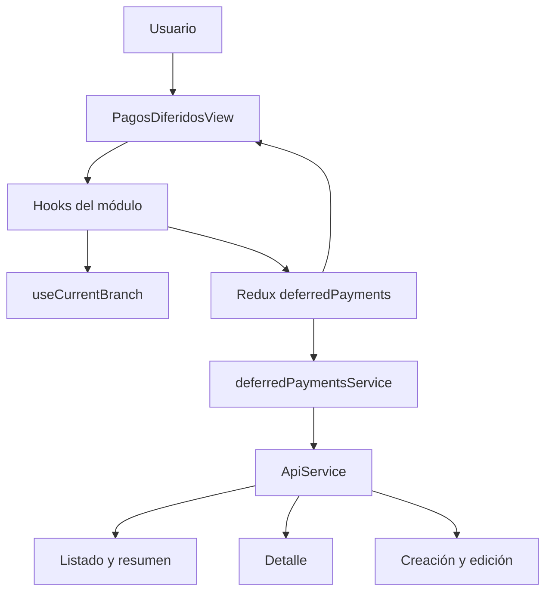

# Implementación frontend — Pagos Diferidos ZF-5, ZF-6 y ZF-7

## 1. Estado actual

La primera versión del módulo utilizó datos simulados mientras se definía el contrato HTTP. Esa etapa terminó: el frontend ahora consume exclusivamente los servicios del módulo para listado, resumen, detalle, creación y edición. Ya no existe una bifurcación de ejecución ni una variable de entorno para elegir el origen de los datos.

Las pruebas usan únicamente datos estáticos mínimos para renderizar casos específicos; no incluyen un motor alternativo de consultas o mutaciones.

### Alcance incluido

- ZF-5: dashboard, KPI, filtros, tabla y paginación.
- ZF-6: detalle del documento y apertura de edición.
- ZF-7: creación y edición de documentos.
- Contratos TypeScript, Redux Toolkit, hooks y servicio HTTP.
- Aislamiento por subsidiaria, cancelación de solicitudes y protección contra respuestas obsoletas.
- Estados de carga, vacío y error.
- Pruebas del servicio, thunks, hooks y componentes.

### Fuera del alcance

- ZF-8: registro y anulación de abonos, marcar como pagada y eliminar documentos.
- ZF-9: administración del perfil de crédito del cliente.
- Cambios en el backend.

## 2. Ubicación y permisos

La pantalla está disponible en:

```text
/comercial/pagos-diferidos
```

El acceso se registra en:

1. `src/config/pages.config.ts`.
2. `src/routes/contentRoutes.tsx`.
3. `src/templates/layouts/Asides/DefaultAside.template.tsx`.

Permisos utilizados:

```ts
ERP_PERMISSIONS.DEFERRED_PAYMENTS.VIEW
ERP_PERMISSIONS.DEFERRED_PAYMENTS.CREATE
ERP_PERMISSIONS.DEFERRED_PAYMENTS.UPDATE
```

La edición utiliza el permiso `edit-deferred-payment` definido por el frontend.

## 3. Arquitectura vigente



Responsabilidades:

- **Vista:** composición visual y estados de interacción.
- **Hooks:** contexto, debounce, filtros, formularios, efectos y cancelación.
- **Slice:** estado remoto, concurrencia y ciclo de vida de solicitudes.
- **Servicio:** rutas HTTP, parámetros, normalización e invalidación de caché.

No existen `deferredPaymentsConfig.ts`, `deferredPaymentsMock.ts` ni flags de selección de origen.

## 4. Endpoints consumidos

Todos los recursos se consultan bajo la subsidiaria activa:

```text
GET   /subsidiaries/{subsidiaryId}/deferred-payments
GET   /subsidiaries/{subsidiaryId}/deferred-payments/summary
GET   /subsidiaries/{subsidiaryId}/deferred-payments/{id}
POST  /subsidiaries/{subsidiaryId}/deferred-payments
PATCH /subsidiaries/{subsidiaryId}/deferred-payments/{id}
```

El servicio usa `ApiService`, propaga `AbortSignal` en lecturas e invalida las entradas de caché relacionadas después de crear o editar.

## 5. Contexto y concurrencia

`useCurrentBranch()` entrega la subsidiaria activa. Sin `subsidiaryId` no se consulta y la vista informa que falta contexto organizacional; no se utiliza un identificador alternativo.

Listado y resumen tienen cargas y errores independientes. Cada solicitud mantiene su `requestId`, y el reducer solo acepta la respuesta que corresponde a la petición vigente. Al desmontar la pantalla o sustituir una consulta, el hook aborta la anterior.

Cuando cambia la subsidiaria se limpian los datos anteriores para evitar mostrar información de otro contexto. Durante una recarga dentro de la misma subsidiaria se conserva la metadata de paginación.

## 6. ZF-5 — Dashboard

La vista incluye:

- KPI de total por cobrar, vencido, por vencer en siete días y pendiente.
- búsqueda por documento, cliente, RUT u orden de compra;
- filtros de estado y rango de vencimiento;
- tabla con paginación manual;
- apertura del detalle mediante clic, Enter o barra espaciadora;
- estados independientes de carga y error para resumen y listado.

`overdue` es una condición temporal, no un estado de pago. Los documentos pagados no muestran una situación de vencimiento.

Los metadatos de paginación proceden del servicio:

```text
current_page, per_page, total, last_page
```

## 7. ZF-6 — Detalle

El drawer obtiene el documento seleccionado mediante el servicio y presenta:

- cliente, RUT, número y tipo de documento;
- emisión, vencimiento, orden de compra y estado;
- montos, progreso y saldo;
- encargados, ítems, seriales, abonos, adjuntos y notas disponibles;
- acción de edición deshabilitada cuando el documento está pagado.

Las acciones correspondientes a ZF-8 permanecen fuera de esta entrega.

## 8. ZF-7 — Crear y editar

El modal utiliza Formik y Yup. La subsidiaria proviene de `useCurrentBranch()` y los clientes y usuarios se cargan desde sus servicios.

El payload contiene:

```json
{
  "customer_sale_id": 4,
  "document_type": "electronic_invoice",
  "document_number": "1900",
  "issue_date": "2026-07-22",
  "due_date": "2026-08-21",
  "purchase_order": "2525",
  "notes": null,
  "assignee_ids": [12, 15],
  "items": [
    {
      "product_id": null,
      "code": "SKU-1",
      "description": "Producto",
      "quantity": 2,
      "unit_price": "10000.00",
      "serials": []
    }
  ]
}
```

La respuesta exitosa conserva `credit_limit_exceeded: false` por compatibilidad. Si el cliente no tiene un perfil de crédito activo o supera su cupo disponible, el backend rechaza la creación o un aumento de `total_amount` en edición con `422` y un `message`; el formulario conserva el borrador y muestra ese mensaje. Bajar, mantener o no enviar el total no activa estas validaciones en edición. Los ítems con precio unitario cero son válidos si el total completo del documento es positivo.

## 9. Pruebas

Los datos estáticos necesarios para renderizar casos de prueba están bajo:

```text
src/pages/comercial/pagosDiferidos/__tests__/
```

La cobertura focalizada incluye:

- normalización y errores del servicio;
- thunks de listado, resumen, detalle, creación y edición;
- concurrencia, cancelación y cambio de subsidiaria;
- filtros, tabla y detalle;
- validación, creación y edición del formulario;
- búsqueda remota y conservación del cliente seleccionado.

Comandos de verificación:

```text
pnpm exec tsc --noEmit
pnpm exec vitest run src/pages/comercial/pagosDiferidos src/services/__tests__/deferredPaymentsService.test.ts src/store/slices/deferredPayments/__tests__/deferredPaymentsThunks.test.ts
```

Resultado registrado para esta entrega:

```text
TypeScript: 0 errores
Vitest: 12 suites / 71 pruebas aprobadas
```

## 10. Prueba manual

1. Inicia el frontend con la configuración habitual del entorno.
2. Selecciona una sucursal que tenga subsidiaria asociada.
3. Navega a `/comercial/pagos-diferidos`.
4. Comprueba que KPI y listado se carguen desde el servicio.
5. Aplica búsqueda, estado, fechas y paginación.
6. Abre un documento y valida su detalle.
7. Crea un documento y comprueba la actualización del listado y resumen.
8. Edita un documento no pagado y verifica que los valores guardados reaparezcan.
9. Confirma que un documento pagado no permita edición.
10. Prueba carga, vacío, error y ausencia de subsidiaria.

No se requiere ninguna variable de entorno específica para alternar fuentes de datos.

## 11. Decisiones vigentes

| Decisión | Motivo |
|---|---|
| Un solo origen de datos en ejecución | Evita divergencias entre entornos y contratos obsoletos |
| Fixtures solo en pruebas | Mantiene escenarios deterministas sin afectar la aplicación |
| Servicio HTTP centralizado | Evita duplicar rutas y normalización |
| Resumen separado del listado | Permite ciclos de carga y error independientes |
| Request IDs y cancelación | Evitan respuestas obsoletas |
| Contexto obligatorio de subsidiaria | Impide consultas o datos fuera del contexto activo |
| Conservar metadata en recargas | Mantiene estable la paginación |
| Limpiar al cambiar de subsidiaria | Evita exposición cruzada de información |

## 12. Estado de la migración

La transición desde datos simulados está completa para ZF-5, ZF-6 y ZF-7. Cualquier desarrollo posterior debe extender `deferredPaymentsService` y sus contratos; no debe reintroducir flags ni ramas alternativas de ejecución.
