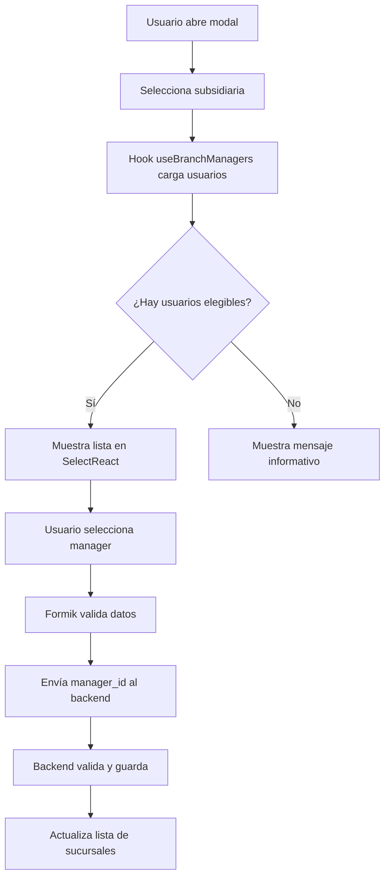

# Mejora en la Gestión de Managers/Encargados de Sucursales

## 📋 Resumen de Cambios

Se ha implementado un sistema completo para la gestión de **managers/encargados de sucursales** que reemplaza el sistema anterior basado en campos de texto (`manager_name`, `manager_phone`, `manager_email`) por una **relación directa con usuarios registrados** en el sistema.

---

## 🎯 Problema Anterior

### ❌ Diseño Antiguo

```json
{
	"branch_id": 1,
	"manager_name": "Juan Pérez", // ❌ Campo de texto libre
	"manager_phone": "+56 9 1234 5678", // ❌ Sin validación
	"manager_email": "juan@email.com" // ❌ Sin relación con usuarios
}
```

**Problemas identificados:**

1. ❌ No había relación con la tabla `users`
2. ❌ Información duplicada (datos del usuario en múltiples lugares)
3. ❌ Sin validación de permisos
4. ❌ Sin verificación de que el usuario tenga acceso a la sucursal
5. ❌ Difícil mantener la integridad referencial

---

## ✅ Nuevo Diseño

### ✅ Estructura Mejorada

```json
{
	"branch_id": 1,
	"manager_id": 5, // ✅ Foreign key a users
	"manager": {
		// ✅ Relación cargada
		"id": 5,
		"first_name": "Juan",
		"last_name": "Pérez",
		"email": "juan@empresa.com",
		"position": "Gerente de Sucursal",
		"roles": ["manager", "admin"]
	}
}
```

**Ventajas del nuevo diseño:**

1. ✅ Integridad referencial garantizada
2. ✅ Información centralizada en la tabla `users`
3. ✅ Validación de permisos automática
4. ✅ Verificación de acceso a la sucursal
5. ✅ Trazabilidad completa
6. ✅ Datos siempre sincronizados

---

## 🏗️ Arquitectura Implementada

### 1. **Hook Personalizado: `useBranchManagers`**

**Ubicación:** `src/pages/gestionAdmin/sucursales/hooks/useBranchManagers.tsx`

```tsx
const { managerOptions, loading } = useBranchManagers({
	branchId: 1, // ID de la sucursal (opcional)
	subsidiaryId: 2, // ID de la subsidiaria (opcional)
	enabled: true, // Control de carga
});
```

**Características:**

- 🔍 Filtra usuarios activos con roles apropiados
- 🏢 Filtra por sucursal o subsidiaria
- 📊 Retorna opciones listas para `SelectReact`
- 🔄 Recarga automática cuando cambian los parámetros
- ⚡ Caché y optimización de rendimiento

**Criterios de elegibilidad para ser manager:**

```typescript
✅ Usuario debe estar activo (is_active = true)
✅ Usuario debe tener acceso a la sucursal (user_branches)
✅ Usuario debe tener rol apropiado:
   - admin
   - gerente
   - supervisor
   - manager
```

---

### 2. **Modal Actualizado: `SucursalModal`**

**Ubicación:** `src/pages/gestionAdmin/sucursales/components/SucursalModal.tsx`

**Cambios implementados:**

#### Antes (❌ Campos de texto):

```tsx
<Input
  name="manager_name"
  placeholder="Ej: Juan Pérez"
  value={formik.values.manager_name}
/>
<Input
  name="manager_phone"
  placeholder="Ej: +56 9 8765 4321"
  value={formik.values.manager_phone}
/>
<Input
  name="manager_email"
  type="email"
  placeholder="Ej: juan.perez@empresa.com"
  value={formik.values.manager_email}
/>
```

#### Ahora (✅ Selector de usuarios):

```tsx
<SelectReact
	name='manager_id'
	placeholder='Seleccione un encargado...'
	value={managerOptions.find((opt) => opt.value === formik.values.manager_id)}
	onChange={(selectedOption) => {
		formik.setFieldValue('manager_id', selectedOption?.value || '');
	}}
	options={managerOptions}
	isLoading={loadingManagers}
	isClearable
/>
```

**Características del selector:**

- 🎨 Diseño mejorado con información contextual
- 📱 Responsive y accesible
- 🔄 Carga dinámica según subsidiaria seleccionada
- ℹ️ Mensajes informativos cuando no hay opciones
- ✨ Muestra nombre completo + cargo del usuario
- 🔍 Búsqueda integrada

---

### 3. **Validación Actualizada**

```typescript
const validationSchema = Yup.object({
	name: Yup.string().required('El nombre es obligatorio').min(2).max(100),
	subsidiary_id: Yup.number().required('Debe seleccionar una subsidiaria'),
	manager_id: Yup.number().nullable().integer('Debe seleccionar un usuario válido'),
	// ... otros campos
});
```

---

## 🗄️ Cambios en Base de Datos

### Migración Recomendada

```php
Schema::table('branches', function (Blueprint $table) {
    // ✅ Agregar campo manager_id (si no existe)
    $table->unsignedBigInteger('manager_id')->nullable()->after('branch_status');

    // ✅ Agregar foreign key
    $table->foreign('manager_id')
          ->references('id')
          ->on('users')
          ->onDelete('set null');

    // ❌ DEPRECATED: Campos antiguos (mantener temporalmente)
    // $table->string('manager_name')->nullable();
    // $table->string('manager_phone')->nullable();
    // $table->string('manager_email')->nullable();
});
```

### Datos de Migración

Si ya tienes datos en los campos antiguos:

```php
// Migrar datos existentes (script de ejemplo)
$branches = DB::table('branches')
    ->whereNotNull('manager_email')
    ->get();

foreach ($branches as $branch) {
    // Buscar usuario por email
    $user = DB::table('users')
        ->where('email', $branch->manager_email)
        ->first();

    if ($user) {
        // Asignar manager_id
        DB::table('branches')
            ->where('id', $branch->id)
            ->update(['manager_id' => $user->id]);
    }
}
```

---

## 🔧 Uso del Sistema

### Crear/Editar Sucursal

1. **Abrir modal** de sucursal
2. **Seleccionar subsidiaria** (obligatorio)
3. **Cargar datos** de la sucursal
4. **Seleccionar encargado** desde el dropdown
    - Solo aparecen usuarios con acceso a la subsidiaria
    - Solo aparecen usuarios con roles apropiados
5. **Guardar** cambios

### Vista de Usuario (Manager)

```tsx
// En la tabla de sucursales
{
  "manager_name": "Juan Pérez - Gerente",
  "manager": {
    "id": 5,
    "first_name": "Juan",
    "last_name": "Pérez",
    "email": "juan@empresa.com",
    "position": "Gerente de Sucursal"
  }
}
```

---

## 📊 Flujo de Datos



---

## 🎨 Interfaz de Usuario

### Sección de Encargado

```tsx
┌─────────────────────────────────────────────┐
│ 👤 Encargado de Sucursal                    │
├─────────────────────────────────────────────┤
│ ℹ️  Seleccione un usuario registrado        │
│    El encargado debe ser un usuario activo  │
│    con acceso a esta sucursal y con         │
│    permisos de administración o gestión.    │
├─────────────────────────────────────────────┤
│ Encargado / Manager                         │
│ ┌─────────────────────────────────────────┐ │
│ │ Juan Pérez - Gerente           ▼       │ │
│ └─────────────────────────────────────────┘ │
└─────────────────────────────────────────────┘
```

---

## 🔐 Permisos y Seguridad

### Validación en Backend

El backend debe validar:

```php
public function assignManager(Request $request, $branchId)
{
    $request->validate([
        'manager_id' => 'required|exists:users,id'
    ]);

    $branch = Branch::findOrFail($branchId);
    $manager = User::findOrFail($request->manager_id);

    // ✅ Verificar que el usuario tenga acceso a la sucursal
    if (!$manager->hasAccessToBranch($branchId)) {
        return response()->json([
            'error' => 'El usuario no tiene acceso a esta sucursal'
        ], 403);
    }

    // ✅ Verificar que el usuario tenga rol apropiado
    if (!$manager->hasRole(['admin', 'manager', 'gerente'])) {
        return response()->json([
            'error' => 'El usuario no tiene permisos de gestión'
        ], 403);
    }

    // ✅ Asignar manager
    $branch->manager_id = $manager->id;
    $branch->save();

    return response()->json(['success' => true]);
}
```

---

## 📝 Endpoints del API

### GET `/api/users`

Obtener usuarios elegibles como managers:

**Query Parameters:**

```
?is_active=1
&roles=admin,gerente,supervisor,manager
&branch_id=1              // Opcional: filtrar por sucursal
&subsidiary_id=2          // Opcional: filtrar por subsidiaria
```

**Respuesta:**

```json
{
	"data": [
		{
			"id": 5,
			"first_name": "Juan",
			"last_name": "Pérez",
			"email": "juan@empresa.com",
			"position": "Gerente",
			"is_active": true,
			"roles": ["manager", "admin"]
		}
	]
}
```

### PUT `/api/branches/{id}`

Actualizar manager de sucursal:

**Body:**

```json
{
	"manager_id": 5
}
```

---

## 🧪 Testing

### Casos de Prueba

```typescript
describe('useBranchManagers', () => {
	it('debe cargar usuarios elegibles para la sucursal', async () => {
		const { result } = renderHook(() => useBranchManagers({ branchId: 1, enabled: true }));

		await waitFor(() => {
			expect(result.current.loading).toBe(false);
			expect(result.current.managers.length).toBeGreaterThan(0);
		});
	});

	it('debe filtrar usuarios inactivos', async () => {
		const { result } = renderHook(() => useBranchManagers({ branchId: 1, enabled: true }));

		await waitFor(() => {
			const inactiveUsers = result.current.managers.filter((m) => !m.is_active);
			expect(inactiveUsers.length).toBe(0);
		});
	});
});
```

---

## 🚀 Migración desde Sistema Antiguo

### Paso 1: Migrar Datos

```sql
-- Crear columna manager_id
ALTER TABLE branches
ADD COLUMN manager_id BIGINT UNSIGNED NULL AFTER branch_status;

-- Migrar datos existentes
UPDATE branches b
JOIN users u ON u.email = b.manager_email
SET b.manager_id = u.id
WHERE b.manager_email IS NOT NULL;

-- Agregar foreign key
ALTER TABLE branches
ADD CONSTRAINT fk_branches_manager
FOREIGN KEY (manager_id) REFERENCES users(id)
ON DELETE SET NULL;
```

### Paso 2: Mantener Compatibilidad (Temporal)

Durante la transición, mantener ambos sistemas:

```php
class Branch extends Model
{
    // ✅ Nueva relación
    public function manager()
    {
        return $this->belongsTo(User::class, 'manager_id');
    }

    // ❌ DEPRECATED: Accessor para compatibilidad
    public function getManagerNameAttribute()
    {
        if ($this->manager) {
            return $this->manager->full_name;
        }
        return $this->attributes['manager_name'] ?? null;
    }
}
```

### Paso 3: Eliminar Campos Antiguos

Después de verificar que todo funciona:

```sql
-- Eliminar columnas antiguas (SOLO después de verificar)
ALTER TABLE branches
DROP COLUMN manager_name,
DROP COLUMN manager_phone,
DROP COLUMN manager_email;
```

---

## 📈 Beneficios Logrados

### 1. **Integridad de Datos**

- ✅ Datos centralizados en `users`
- ✅ No hay duplicación de información
- ✅ Foreign keys garantizan consistencia

### 2. **Seguridad Mejorada**

- ✅ Validación de permisos automática
- ✅ Verificación de acceso a sucursales
- ✅ Roles verificados en tiempo real

### 3. **Experiencia de Usuario**

- ✅ Selector intuitivo con búsqueda
- ✅ Información contextual clara
- ✅ Validación en tiempo real
- ✅ Mensajes informativos

### 4. **Mantenibilidad**

- ✅ Código reutilizable (hook personalizado)
- ✅ Separación de responsabilidades
- ✅ Fácil de testear
- ✅ Escalable

---

## 🔄 Próximos Pasos

### Mejoras Futuras

1. **Dashboard de Manager**
    - Vista personalizada para el encargado
    - Métricas de la sucursal
    - Gestión de equipo

2. **Notificaciones**
    - Alertar al manager cuando es asignado
    - Notificar cambios en la sucursal

3. **Historial de Managers**
    - Tabla de auditoría: `branch_managers_history`
    - Rastrear quién fue manager y cuándo

4. **Permisos Granulares**
    - Permisos específicos por sucursal
    - Control de acceso más detallado

5. **Multi-Manager**
    - Permitir múltiples managers por sucursal
    - Tabla pivot: `branch_manager` (many-to-many)

---

## 📚 Referencias

- **Hook:** `src/pages/gestionAdmin/sucursales/hooks/useBranchManagers.tsx`
- **Modal:** `src/pages/gestionAdmin/sucursales/components/SucursalModal.tsx`
- **Interface:** `src/interface/empresas.interface.ts`
- **Slice:** `src/store/slices/sucursales/sucursalesSlice.ts`

---

## 👥 Equipo y Contacto

**Implementado por:** Sistema AI  
**Fecha:** Noviembre 2025  
**Versión:** 1.0.0

---

## ✅ Checklist de Implementación

- [x] Crear hook `useBranchManagers`
- [x] Actualizar `SucursalModal` para usar selector de usuarios
- [x] Eliminar campos de texto antiguos del formulario
- [x] Actualizar validación con Yup
- [x] Agregar mensajes informativos
- [x] Mejorar diseño visual
- [ ] Actualizar backend para soportar `manager_id`
- [ ] Migrar datos existentes
- [ ] Agregar tests unitarios
- [ ] Actualizar documentación de API
- [ ] Eliminar campos deprecated del backend

---

**¡Sistema de Managers/Encargados implementado exitosamente! 🎉**
