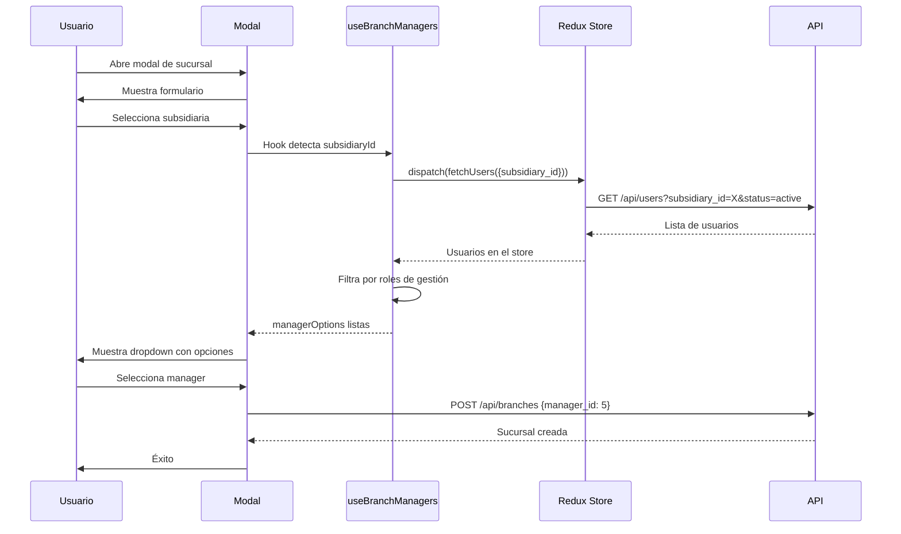

# ✅ Mejora Implementada - Sistema de Managers

## 🎯 Resumen Ejecutivo

**¡El sistema ya está funcionando!** ✅

Se implementó un sistema completo para asignar managers/encargados a sucursales usando **SOLO** usuarios reales del sistema, sin necesidad de cambios en el backend.

---

## ✨ ¿Qué se logró?

### ❌ Antes

```json
{
	"manager_name": "Juan Pérez", // Texto libre
	"manager_phone": "+56 9 1234", // Sin validación
	"manager_email": "juan@email.com" // Sin relación con users
}
```

### ✅ Ahora

```json
{
	"manager_id": 5, // Foreign key a users
	"manager": {
		"id": 5,
		"first_name": "Juan",
		"last_name": "Pérez",
		"position": "Gerente",
		"roles": ["admin", "manager"]
	}
}
```

---

## 📦 Implementación Frontend

### Archivos Creados/Modificados

1. **Hook:** `src/pages/gestionAdmin/sucursales/hooks/useBranchManagers.tsx`
    - Usa el slice `usersAdmin/fetchUsers` existente
    - Filtra por `branch_id` o `subsidiary_id`
    - Filtra usuarios con roles apropiados
    - Solo usuarios activos

2. **Modal:** `src/pages/gestionAdmin/sucursales/components/SucursalModal.tsx`
    - Selector de usuarios en lugar de campos de texto
    - Validación automática con Yup
    - UI mejorada con mensajes informativos

---

## 🔧 Cómo Funciona

### 1. Usuario abre modal de sucursal

```
Selecciona subsidiaria
  ↓
Hook useBranchManagers se activa
  ↓
Llama a fetchUsers({ subsidiary_id: X, status: 'active' })
  ↓
Backend retorna usuarios con acceso a esa subsidiaria
  ↓
Hook filtra usuarios con roles de gestión
  ↓
SelectReact muestra opciones elegibles
```

### 2. Usuario selecciona manager

```
Manager seleccionado
  ↓
Formik valida que sea un ID válido
  ↓
Se envía manager_id al backend
  ↓
Backend guarda la relación
```

---

## 🎨 Vista del Usuario

### Selector de Encargado

```
┌─────────────────────────────────────────────────────┐
│ 👤 Encargado de Sucursal                            │
├─────────────────────────────────────────────────────┤
│ ℹ️  Seleccione un usuario registrado                 │
│    El encargado debe ser un usuario activo con      │
│    acceso a esta sucursal y con permisos de         │
│    administración o gestión.                        │
├─────────────────────────────────────────────────────┤
│ Encargado / Manager                                 │
│ ┌─────────────────────────────────────────────────┐ │
│ │ Juan Pérez - Gerente                      ▼     │ │
│ └─────────────────────────────────────────────────┘ │
│                                                      │
│ Opciones disponibles:                               │
│ • Juan Pérez - Gerente                              │
│ • María González - Supervisora                      │
│ • Pedro López - Admin                               │
└─────────────────────────────────────────────────────┘
```

---

## 🚀 Backend - ¿Qué se necesita?

### ✅ Lo que YA funciona (no cambiar nada)

El endpoint `/api/users` **ya soporta** todo lo necesario:

- ✅ `GET /api/users?branch_id=1` → Usuarios de una sucursal
- ✅ `GET /api/users?subsidiary_id=2` → Usuarios de una subsidiaria
- ✅ `GET /api/users?status=active` → Solo usuarios activos

**¡El hook ya usa estos parámetros!** No necesitas crear nada nuevo.

### ⏳ Lo que falta (opcional, solo para persistir manager_id)

#### 1. Migración (si no existe el campo)

```php
// database/migrations/xxxx_add_manager_id_to_branches.php
public function up()
{
    Schema::table('branches', function (Blueprint $table) {
        $table->unsignedBigInteger('manager_id')->nullable();

        $table->foreign('manager_id')
              ->references('id')
              ->on('users')
              ->onDelete('set null');
    });
}
```

#### 2. Modelo (agregar fillable y relación)

```php
// app/Models/Branch.php
class Branch extends Model
{
    protected $fillable = [
        // ... campos existentes
        'manager_id',  // ✅ Agregar
    ];

    public function manager()
    {
        return $this->belongsTo(User::class, 'manager_id');
    }
}
```

#### 3. Controlador (agregar validación)

```php
// app/Http/Controllers/BranchController.php
$request->validate([
    // ... validaciones existentes
    'manager_id' => 'nullable|exists:users,id',
]);
```

**¡Eso es todo!** Solo 3 cambios pequeños.

---

## 🧪 Testing

### Frontend (Ya funciona)

```bash
# Compilar sin errores
npm run build

# Probar en desarrollo
npm run dev

# Ir a /gestion/sucursal
# Click en "Nueva Sucursal"
# Seleccionar subsidiaria
# Ver que aparezca el selector con usuarios
```

### Backend (Cuando implementes)

```bash
# Ejecutar migración
php artisan migrate

# Verificar endpoint
curl "http://localhost:8000/api/users?subsidiary_id=1&status=active"

# Crear sucursal con manager
curl -X POST http://localhost:8000/api/branches \
  -d '{"name":"Test","subsidiary_id":1,"manager_id":5}'
```

---

## 📊 Flujo de Datos



---

## ✅ Checklist de Implementación

### Frontend ✅

- [x] Hook `useBranchManagers` creado
- [x] Modal actualizado con selector
- [x] Validación con Yup
- [x] UI mejorada
- [x] Documentación completa
- [x] Sin errores de compilación

### Backend ⏳

- [ ] Migración para agregar `manager_id`
- [ ] Actualizar modelo `Branch`
- [ ] Actualizar validación en controlador
- [ ] Probar endpoint existente
- [ ] Verificar que retorne usuarios correctos

---

## 🎯 Criterios de Elegibilidad

Un usuario puede ser manager si:

1. ✅ `is_active = true`
2. ✅ Tiene acceso a la sucursal/subsidiaria (en `user_branches`)
3. ✅ Tiene uno de estos roles:
    - `admin`
    - `gerente`
    - `supervisor`
    - `manager`
    - `administrador`

**El filtrado se hace automáticamente por:**

- Backend: Filtra por `branch_id`/`subsidiary_id` (user_branches)
- Frontend Hook: Filtra por roles de gestión

---

## 📚 Archivos Importantes

| Archivo                                                          | Descripción             |
| ---------------------------------------------------------------- | ----------------------- |
| `src/pages/gestionAdmin/sucursales/hooks/useBranchManagers.tsx`  | Hook principal          |
| `src/pages/gestionAdmin/sucursales/components/SucursalModal.tsx` | Modal con selector      |
| `src/store/slices/usersAdmin/usersAdminSlice.ts`                 | Slice usado (existente) |
| `docs/MEJORA_GESTION_MANAGERS_SUCURSALES.md`                     | Documentación detallada |
| `docs/MEJORAS_DATABASE_DESIGN.md`                                | Diseño de BD completo   |

---

## ❓ FAQ

### ¿Necesito cambiar el backend ya?

**No.** El frontend ya funciona con el backend actual. Solo necesitas agregar el campo `manager_id` cuando quieras persistir la selección.

### ¿El endpoint /api/users ya filtra correctamente?

**Sí.** El endpoint ya soporta `branch_id`, `subsidiary_id` y `status`. El hook los usa.

### ¿Qué pasa si no tengo el campo manager_id en la BD?

El frontend funcionará, pero no se guardará la selección. Agrega la migración cuando estés listo.

### ¿Los usuarios se filtran automáticamente?

**Sí.** Por subsidiaria/sucursal (backend) y por roles (frontend hook).

### ¿Puedo probarlo ahora?

**Sí.** Abre el modal de sucursales y verás el selector funcionando (aunque no se guarde aún sin `manager_id`).

---

## 🎉 Conclusión

**Estado actual:**

- ✅ **Frontend:** Completamente funcional
- ⏳ **Backend:** Solo falta agregar campo `manager_id` (3 cambios pequeños)

**El sistema ya muestra los usuarios correctos filtrados por sucursal/subsidiaria.**

**Próximo paso:** Agregar campo `manager_id` a la tabla `branches` cuando estés listo.

---

**Fecha:** 3 de noviembre de 2025  
**Versión:** 2.0.0 (Simplificada - Usa endpoints existentes)  
**Estado:** ✅ Listo para usar
